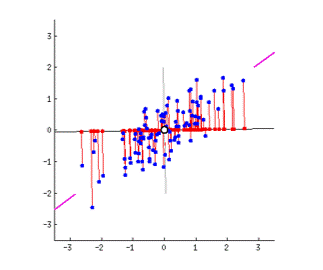
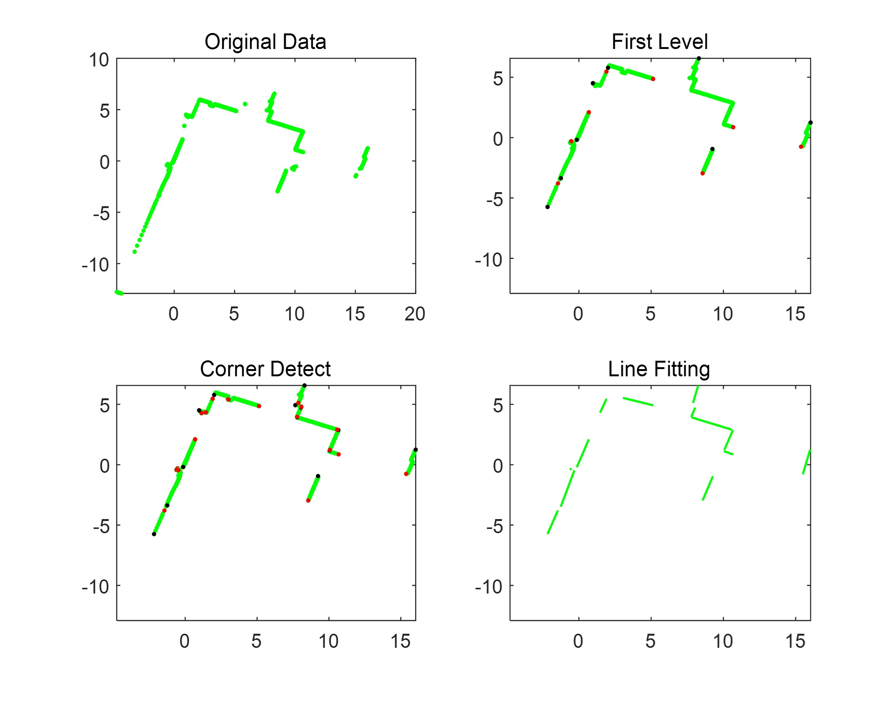

# point_cloud_processing
Lidar slam w/ open source MATLAB frame. Research on line features recognition and extraction

In the beginning, I noted that the line features of the 
indoor environment are apparent, e.g.: the outlines of walls or tables. Therefore, I decided to 
utilize clustering and linear fitting to extract features in a single-scan point cloud.  
## Single scan feature extraction
The clusters were initially determined by the distance between points. This led to the incorrect 
classification of points around corners due to the narrow spacing. After I developed and 
applied a Corner Detection algorithm, an explicit linear characteristic was demonstrated for 
each cluster. Next, I implemented **Principal Component Analysis** to obtain the line segments’ 
slopes and endpoints.  

  
  
Figure 1. Illustration of how PCA works

  
  
Figure 2. Single scan point cloud before/after processing

In the last stage, density-based clustering was performed to fuse the features in 
multi-scan data. Specifically, I combined DBSCAN and Mean Shift clustering to 
process the data (the slope and two endpoints), enabling the potentially coincident lines to be 
labeled the same and merged. <be>

The result showed that a 5522 by 1052 dataset could be 
reduced to 700 line segments, while the processing time was within 5 minutes.
