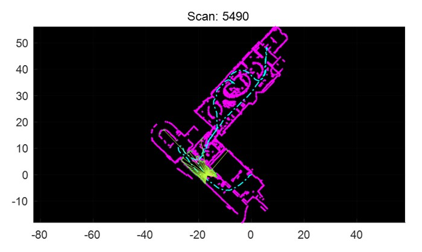

# point_cloud_processing
Lidar slam w/ open source MATLAB framework. Research on line features recognition and extraction.
[Source](https://github.com/meyiao/LaserSLAM/tree/master) 
<table>
  <tr>
<td></td>
  </tr>
  <tr>
<td>Figure 1. MATLAB open source framework</td>
  </tr>
</table>

In the beginning, I noted that the line features of the 
indoor environment are apparent, e.g.: the outlines of walls or tables. Therefore, I decided to 
utilize clustering and linear fitting to extract features in a single-scan point cloud.  

## Single scan feature extraction
The clusters were initially determined by the distance between points. This led to the incorrect 
classification of points around corners due to the narrow spacing. After I developed and 
applied a Corner Detection algorithm, an explicit linear characteristic was demonstrated for 
each cluster. Next, I implemented **Principal Component Analysis** to obtain the line segments’ 
slopes and endpoints.  
<table>
  <tr>    
    <td></td>
  </tr>
  <tr>
    <td>
Figure 2. Single scan point cloud before/after processing
</td>
  </tr>
</table>

## Multi scan feature merge
In the last stage, density-based clustering was performed to fuse the features in 
multi-scan data. Specifically, I combined DBSCAN and Mean Shift clustering to 
process the data (the slope and two endpoints), enabling the potentially coincident lines to be 
labeled the same and merged.  

<table>
  <tr>
    <td></td>
    <td></td>
    <td></td>
  </tr>
  <tr>
    <td>
Figure 3. Origin data after line fitting
</td>
    <td>
Figure 4. Data after DBSCAN
</td>
    <td>
Figure 5. Data after Meanshift
</td>   
  </tr>
</table>
          
## Result
The result showed that a 5522 by 1052 dataset could be 
reduced to 700 line segments, while the processing time was within 5 minutes.

<table>
  <tr>
  <td></td>
  <td></td>
  </tr>
  <tr>
  <td>
Figure 6. Original data w/ number of lines
</td>
    <td>
Figure 7. Data after feature merging w/ num of lines
</td>   
  </tr>
</table>
